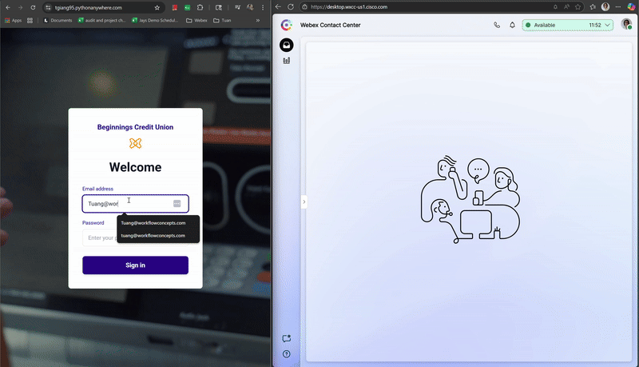

# Header Widget Sample




**Last updated: Tuan Giang, 2025-08-12**

This is a demo for Beginnings Credit Union (formerly known as CFCU). The demo demonstrate that once a customer places a message from a secure portal then the header widget will display to the agent that they are engaged in a secure chat. 

This project was forked from [RSS Header Widget Sample](https://github.com/WebexSamples/webex-contact-center-api-samples/tree/main/widget-samples/rss-header-widget-sample)
**Note:** Cisco's documentation was off. Particularly the way with the way that they said to point to which build file. 

```shell
# Instead of this - 
http://localhost:8000/rss-feed.js

# It should have been this - 
http://localhost:8000/build/rss-feed.js
```

[Read more about Cisco's documentation](archive/README.MD)

## Header widget high level 

The backend is reading in the Datastore values of  `$STORE.agentContact.taskMap` mapped to `cad` in the `layout.json` and iterate through the local datastore for a specific queue **SECURE_CHAT_TG** (it reads and update every 3s). If it finds that the user is engaged in the **SECURE_CHAT_TG** then it will render the header widget. 

## Serving the project:

To build the project, run:

```shell
npm run build
```

This command will generate a production-ready, IIFE standalone JavaScript file in the build directory using Rollup that can be used with Webex Contact Center.

## Serving the built files:

```shell
npm start 
```

I found that once I uploaded the project to git repository then I could use this library https://aizhee.github.io/Github-to-jsDelivr-Generator/ to generate a public cdn link to render the header widget. Otherwise, if it is being built on a local machine then points it to the localhost address from the nodejs server start - e.g, `http://localhost:8000/build/rss-widget.js`


